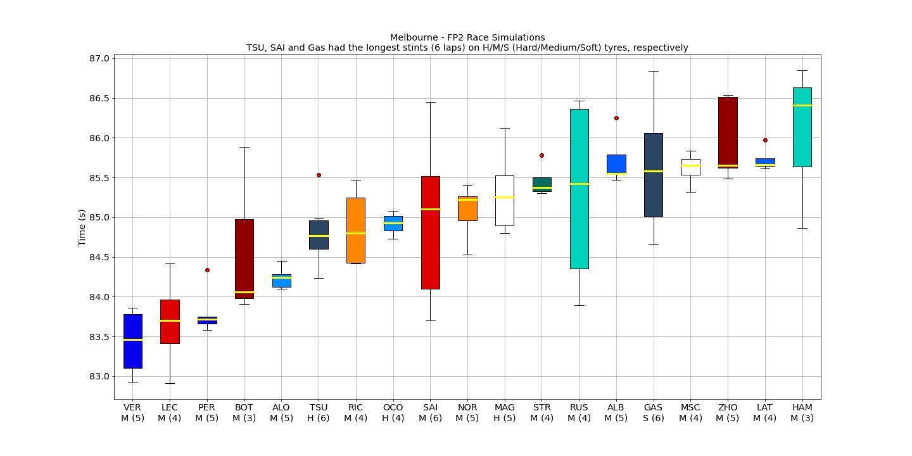
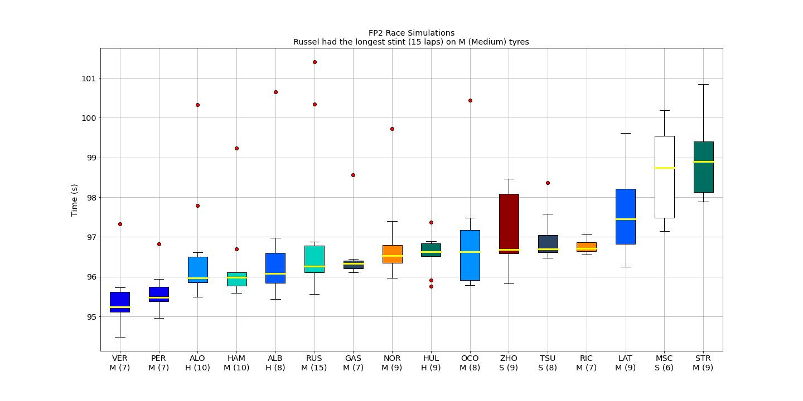

# F12022 FP2 Race Simulation

This repository provides an insight for race pace of each driver (which is based on FP2 session of each weekend)

<b>Australia 2022:</b>

Yet again, RedBull setting the pace in FP2.
P.S.: Due to the red flags, data of drivers with less than 4 laps (on the same stint) has been discarded.

<b>Jeddah 2022:</b>

RedBull setting the pace in FP2. If the reliability problem is resolved, Max has a good chance of snatching his first win here.
P.S.: Ferrari was unable to do race sims since they hit the wall. Also data of drivers with less than 5 laps (on the same stint) has been discarded.

<b>Bahrain 2022:</b>

Note: RIC and LEC's stints were 2 and 3 laps respectively; Thus, the data isn't very accurate.

