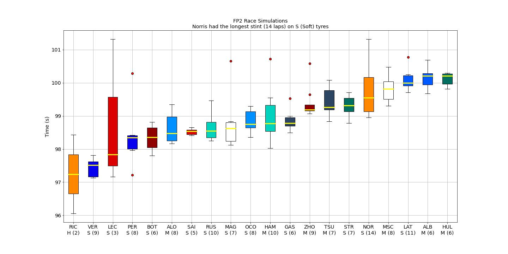

# F12022 FP2 Race Simulation
This repository provides an insight for race pace of each driver (which is based on FP2 session of each weekend)

<b>Bahrain 2022:</b>

Note: RIC and LEC's stints were 2 and 3 laps respectively; Thus, the data isn't very accurate.
